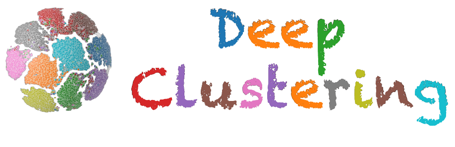

<p align="center">
  <a href="#about">Overview</a> •
  <a href="#installation">Installation</a> •
  <a href="#citation">Citation</a> 
</p>

[](https://github.com/zhoushengisnoob/OpenDeepClustering/stargazers)
[](LICENSE)
[](https://github.com/zhoushengisnoob/OpenDeepClustering/commits/main)
[](#projects-using-open-deep-clustering)
[](https://github.com/zhoushengisnoob/OpenDeepClustering/pulls)

## About
Hello :wave:, we are a team of researchers from the Eagle-Lab (InnovativE SoftwAre TechnoloGy DeveLopment CentEr), Zhejiang University. Here are two questions and answers that embody the essence of our mission for this repository.
### What is clustering task?
The primary purpose of clustering is to assign the instances into groups so that the similar samples belong to the same cluster while dissimilar samples belong to different clusters.
### Why deep clustering?
Although shallow clustering methods like KMeans have achieved tremendous success, they can no longer be directly applied to deal with high-dimension or complicated unstructured data like images. 

**Deep Clustering**, which aims at joint optimization of deep representation learning and clustering, arises and has attracted increasing attention recently in the community.

## :dart:News
[24/05/06] We have already implemented **10+ algorithms** which can be classified into four categories (Generative, Iterative, MultiStage, Simultaneous) locally. These algorithms will be uploaded soon after rigorous testing. **If you find this repository useful for you studies, please star it** :star:.

[24/05/07] We have added the DEC and IDEC algorithms to our repository.

## Supported Models
| Model                                                 | Taxonomy     | Clustering Module  | Type  | GPU Memory |
| ----------------------------------------------------- | ------------ | ------------------ | ----- | ---|
| [DEC](https://proceedings.mlr.press/v48/xieb16.pdf) | Simultaneous | Auto-encoder based | Image |3G|
[IDEC](https://www.researchgate.net/profile/Xifeng-Guo/publication/317095655_Improved_Deep_Embedded_Clustering_with_Local_Structure_Preservation/links/59263224458515e3d4537edc/Improved-Deep-Embedded-Clustering-with-Local-Structure-Preservation.pdf)|Simultaneous | Auto-encoder based | Image |3G|
| update soon                          | ... | ... | ... | ... 


## Supported Dataset
|Dataset                                                 | Classes     | RGB  | Type  | Shape|
| ----------------------------------------------------- | ------------ | ------------------ | ----- | ----|
| [MNIST](https://pytorch.org/vision/stable/generated/torchvision.datasets.MNIST.html#mnist) | 10 | :negative_squared_cross_mark: | Image | 28 * 28 |
| [STL10](https://pytorch.org/vision/stable/generated/torchvision.datasets.STL10.html?highlight=stl10#torchvision.datasets.STL10) | 10 | :white_check_mark: | Image | 96 * 96 |
| [CIFAR10](https://pytorch.org/vision/stable/generated/torchvision.datasets.CIFAR10.html#cifar10) | 10 | :white_check_mark:	 | Image | 32 * 32 |
| [CIFAR100](https://pytorch.org/vision/stable/generated/torchvision.datasets.CIFAR100.html?highlight=cifar100#torchvision.datasets.CIFAR100) | 100 | :white_check_mark:	 | Image |
| update soon                          | ... | ... | ... |...

## Installation
Step-1, clone this repository.
```sh
git clone https://github.com/zhoushengisnoob/OpenDeepClustering.git
cd OpenDeepClustering
```

Step-2, create a new conda environment and download the dependencies.
```sh
conda create -n deepclustering python=3.10 -y
conda activate deepclustering
pip install -r requirements.txt
```

## :rocket:Quick start
> [!IMPORTANT]
> Please be sure to make `OpenDeepClustering` as the working directory if you want to run the code.

**(Recommend way)**
Please modify the configuration files in the `configs` packages before running the codes. 
- The `base.yaml` contains the basic experiment settings for all the methods.
- A yaml file with a similar naming format like `DEC.yaml` contains the specific hyper parameters.
```sh
cd OpenDeepClustering
# if pretrain is need
python models/Simultaneous/DEC/pretrain.py
python models/Simultaneous/DEC/main.py
```

(Alternative way) Please refer to the `scripts` packages for direct running script with default settings.
```sh
cd OpenDeepClustering
bash scripts/dec_pretrain.sh

# dec_pretrain.sh
nohup python -u models/Simultaneous/DEC/pretrain.py \
    --dataset_name MNIST \
    --dataset_dir ~/dataset \
    --class_num 10 \
    --grey True \
    --img_size_at 28 28 \
    --optimizer sgd \
    --lr 0.1 \
    --weight_decay 0 \
    --sgd_momentum 0.9 \
    --use_vision False \
    --batch_size 256 \
    --num_workers 16 \
    --verbose True \
    --save_step 5000 \
    --dims 500 500 2000 10 \
    >./exps/mnist/dec/pretrain.log &
```
> [!TIP]
> - log will be saved in `./logs/datasetname/methodname/trainingtype/`
>  - model will be saved in `./model_saves/datasetname/methodname/trainingtype/`
> - nohup files will be saved in `./exps/datasetname/methodname/trainingtype`


## Implementation Results
|Model |Backbone | MNIST | STL10  | CIFAR10  |
| ----------------------------------------------------- |---- |------------ | ------------------ | ----- |
| [DEC](https://proceedings.mlr.press/v48/xieb16.pdf) | / | 69.79% | 26.56% | 21.13% |
|[IDEC](https://www.researchgate.net/profile/Xifeng-Guo/publication/317095655_Improved_Deep_Embedded_Clustering_with_Local_Structure_Preservation/links/59263224458515e3d4537edc/Improved-Deep-Embedded-Clustering-with-Local-Structure-Preservation.pdf)| /| 69.31% | 26.60% | 21.19%|
|update soon| ... | ... | ... | ...|

## Citation
:smiley:Our paper is posted on arXiv: [A comprehensive survey on deep clustering: Taxonomy, challenges, and future directions](https://arxiv.org/abs/2206.07579). 
```
@article{zhou2022comprehensive,
  title={A comprehensive survey on deep clustering: Taxonomy, challenges, and future directions},
  author={Zhou, Sheng and Xu, Hongjia and Zheng, Zhuonan and Chen, Jiawei and Bu, Jiajun and Wu, Jia and Wang, Xin and Zhu, Wenwu and Ester, Martin and others},
  journal={arXiv preprint arXiv:2206.07579},
  year={2022}
}
```

## Contact
If you have any questions or suggestions while using our code, please feel free to contact us via the following ways. Our response will be sent to you quickly.

:point_right: Submit an issue in the GitHub repository with [link](https://github.com/zhoushengisnoob/OpenDeepClustering/issues).

<!-- :email: Send us a email: [rencailgb@gmail.com](mailto:rencailgb@gmail.com) -->

## Star History
