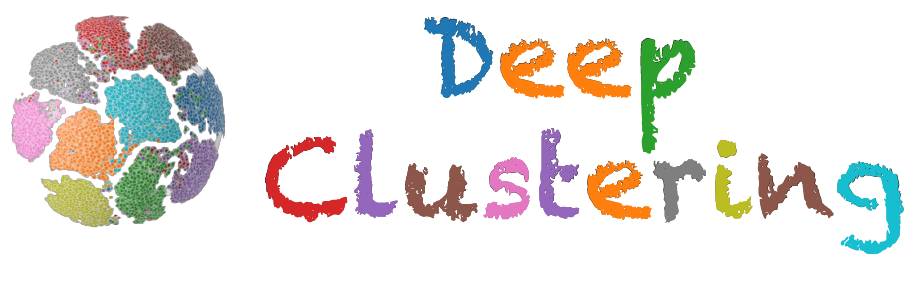

# OpenDeepClustering



[](https://github.com/zhoushengisnoob/OpenDeepClustering/actions/workflows/ci.yml)
[](https://github.com/zhoushengisnoob/OpenDeepClustering/releases/tag/v0.2.0)
[](LICENSE)

OpenDeepClustering is a scikit-learn-style research library accompanying our [survey of deep clustering](https://doi.org/10.1145/3689036). It organizes methods by how representation learning and clustering interact, with a shared Python API and reproducible benchmark CLI.

**Current release:** [v0.2.0](https://github.com/zhoushengisnoob/OpenDeepClustering/releases/tag/v0.2.0). The supported package is distinct from the historical reproduction scripts still present under `models/` and `scripts/`.

## Implemented estimators

| Survey pattern | Estimator | Evidence status | Inputs |
| --- | --- | --- | --- |
| Multi-stage | `AutoencoderKMeans` | Architecture reference | Dense tabular features |
| Iterative | `DeepCluster` | Architecture reference | Dense tabular features or NCHW image tensors |
| Generative | `VaDE` | Architecture reference | Dense tabular features |
| Simultaneous | `DEC`, `IDEC` | Reference implementations | Dense tabular features |

All five expose `fit`, `fit_predict` and `transform`. `predict` is available when the chosen shallow clusterer supports it; DEC, IDEC and VaDE also expose soft assignments. VaDE additionally supports sampling. See the [algorithm status](docs/algorithms.md) and [estimator contract](docs/architecture/estimator-contract.md) for precise capabilities.

“Architecture reference” means the method's defining interaction pattern and mathematical core are implemented and tested. It does **not** claim an exact reproduction of the original paper's architecture or reported scores. DEC/IDEC have [five-seed MNIST evidence](docs/benchmarks/mnist-reference-2026-09-15.md); the other representatives currently have [architecture smoke evidence](docs/benchmarks/four-pattern-smoke-2026-09-15.md) and committed reference configurations, but not completed multi-seed quality reports.

## Installation

Python 3.10 and 3.11 are tested in CI. Install from a checkout:

```bash
git clone https://github.com/zhoushengisnoob/OpenDeepClustering.git
cd OpenDeepClustering
python -m venv .venv
source .venv/bin/activate
python -m pip install --upgrade pip
python -m pip install -e .
```

For the exact v0.2.0 artifact, install the [release wheel](https://github.com/zhoushengisnoob/OpenDeepClustering/releases/download/v0.2.0/opendeepclustering-0.2.0-py3-none-any.whl) with `python -m pip install <downloaded-wheel-path>`. This release has **not** been published to PyPI. For the optional MNIST loader, install `.[image]` from a checkout.

## Quick start

A small CPU example that needs no dataset download:

```python
from sklearn.datasets import make_blobs
from opendeepclustering import AutoencoderKMeans

X, _ = make_blobs(
    n_samples=120, n_features=8, centers=3, random_state=7
)
model = AutoencoderKMeans(
    n_clusters=3,
    dims=(16, 3),
    max_epochs=1,
    batch_size=32,
    random_state=7,
    deterministic=True,
    device="cpu",
)
labels = model.fit_predict(X)
embedding = model.transform(X)
print(labels.shape, embedding.shape)
```

The package accepts finite dense arrays or tensors. Most estimators expect 2D samples; DeepCluster also accepts explicit NCHW image tensors. Image flattening is a deliberate data-adapter choice, not an automatic behavior of every estimator.

The CLI uses the same estimator implementations:

```bash
odc benchmark --config configs/benchmarks/autoencoder_kmeans_smoke.yaml
```

Run benchmark configurations from a source checkout. Smoke runs use synthetic data and validate wiring, **not** algorithm quality. The current CLI supports synthetic blobs, NPZ files and MNIST (with optional torchvision); dataset downloads are never implicit. Benchmark JSON records configuration, Git revision, environment, data checksums, seed-level metrics and stopping information. See the [benchmark guide](docs/benchmarking.md) and [quickstart](docs/quickstart.md).

## Reproducibility and legacy code

The supported package API, configurations and evidence live in `opendeepclustering/`, `configs/benchmarks/` and `docs/benchmarks/`. The older `models/`, `scripts/` and `configs/DEC.yaml`/`configs/IDEC.yaml` paths remain for historical reproduction; they are not the v0.2.0 installation or benchmarking interface. Results previously shown for MNIST, STL10 and CIFAR10 in this README came from that legacy workflow and should not be compared directly with the versioned package benchmarks.

Development history is in the [changelog](CHANGELOG.md); the next evidence and usability work is tracked in the [v0.3 roadmap](https://github.com/zhoushengisnoob/OpenDeepClustering/issues/19). Contributions are welcome via [issues](https://github.com/zhoushengisnoob/OpenDeepClustering/issues) and [pull requests](https://github.com/zhoushengisnoob/OpenDeepClustering/pulls); see [CONTRIBUTING.md](CONTRIBUTING.md).

## Citation

If this repository supports your work, please cite the survey and the software. [`CITATION.cff`](CITATION.cff) contains the authoritative citation metadata.

```bibtex
@article{zhou2025comprehensive,
  title={A Comprehensive Survey on Deep Clustering: Taxonomy, Challenges, and Future Directions},
  author={Zhou, Sheng and Xu, Hongjia and Zheng, Zhuonan and Chen, Jiawei and Li, Zhao and Bu, Jiajun and Wu, Jia and Wang, Xin and Zhu, Wenwu and Ester, Martin},
  journal={ACM Computing Surveys},
  volume={57},
  number={3},
  pages={1--38},
  year={2025},
  doi={10.1145/3689036}
}
```

OpenDeepClustering is distributed under the [BSD-2-Clause license](LICENSE).
