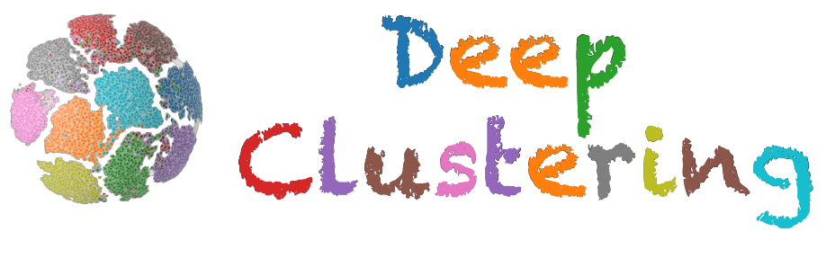

# OpenDeepClustering



[](https://github.com/zhoushengisnoob/OpenDeepClustering/actions/workflows/ci.yml)
[](https://github.com/zhoushengisnoob/OpenDeepClustering/releases/tag/v0.2.0)
[](LICENSE)

OpenDeepClustering is a scikit-learn-style research library accompanying our [survey of deep clustering](https://doi.org/10.1145/3689036). It organizes methods by how representation learning and clustering interact, with a shared Python API and reproducible benchmark CLI.

**Current release:** [v0.2.0](https://github.com/zhoushengisnoob/OpenDeepClustering/releases/tag/v0.2.0). The supported package is distinct from the historical reproduction scripts still present under `models/` and `scripts/`.

## Implemented estimators

| Survey pattern | Estimator | Evidence status | Inputs |
| --- | --- | --- | --- |
| Multi-stage | `AutoencoderKMeans` | Architecture reference | Dense tabular features |
| Iterative | `DeepCluster` | Architecture reference | Dense tabular features or NCHW image tensors |
| Generative | `VaDE` | Architecture reference | Dense tabular features |
| Simultaneous | `DEC`, `IDEC` | Reference implementations | Dense tabular features |

All five expose `fit`, `fit_predict` and `transform`. `predict` is available when the chosen shallow clusterer supports it; DEC, IDEC and VaDE also expose soft assignments. VaDE additionally supports sampling. See the [algorithm status](docs/algorithms.md) and [estimator contract](docs/architecture/estimator-contract.md) for precise capabilities.

“Architecture reference” means the method's defining interaction pattern and mathematical core are implemented and tested. It does **not** claim an exact reproduction of the original paper's architecture or reported scores. DEC/IDEC have [five-seed MNIST evidence](docs/benchmarks/mnist-reference-2026-09-15.md); the other representatives currently have [architecture smoke evidence](docs/benchmarks/four-pattern-smoke-2026-09-15.md) and committed reference configurations, but not completed multi-seed quality reports.

## Installation

### Validated Linux GPU environment

Use one **project-local `.venv`** for installation, testing and experiments. The following environment was validated on Ubuntu 24.04.3 LTS with four RTX 3090 GPUs and NVIDIA driver 580.173.02 on 2026-09-30:

| Component | Validated version |
| --- | --- |
| Python | 3.12.3 |
| PyTorch | 2.5.1+cu124 |
| torchvision | 0.20.1+cu124 |
| CUDA runtime supplied by the PyTorch wheels | 12.4 |
| NumPy | 1.26.4 |
| SciPy | 1.11.4 |
| scikit-learn | 1.4.2 |

Python 3.10 and 3.11 remain covered by CI; Python 3.12 was additionally validated on this GPU server. This is a working runtime profile, not the identical environment used for the earlier [five-seed MNIST reference](docs/benchmarks/mnist-reference-2026-09-15.md).

Install Python 3.12 with `venv` support and an NVIDIA driver that supports CUDA 12.4 before starting. On Ubuntu, the relevant Python packages are `python3.12` and `python3.12-venv`. Check the driver with `nvidia-smi`. The prebuilt PyTorch wheels supply the CUDA runtime; this workflow does not require compiling PyTorch or installing a separate CUDA toolkit.

```bash
git clone https://github.com/zhoushengisnoob/OpenDeepClustering.git
cd OpenDeepClustering

python3.12 -m venv .venv
source .venv/bin/activate
python -m pip install --upgrade pip "setuptools>=77"

python -m pip install "numpy==1.26.4" "scipy==1.11.4" "scikit-learn==1.4.2"
python -m pip install "torch==2.5.1" "torchvision==0.20.1" \
    --index-url https://download.pytorch.org/whl/cu124
python -m pip install -e ".[test,image,benchmark]"
python -m pip check
```

Keep PyTorch and torchvision paired as in the [official version instructions](https://pytorch.org/get-started/previous-versions/). `pyproject.toml` is the authoritative dependency specification; `test`, `image` and `benchmark` install the experiment and validation extras. For development and documentation tools, also install `.[dev,docs]` in this same environment.

If PyPI downloads are slow, append `--index-url https://pypi.tuna.tsinghua.edu.cn/simple` to the non-PyTorch installation commands. Keep the PyTorch command's CUDA wheel index unchanged. For Linux CPU-only use, replace `cu124` with `cpu` in that command and skip the CUDA checks below. Other platforms should select their wheel source using the official PyTorch instructions.

### Activate before every experiment

From the cloned repository, run this in each new shell, SSH session or batch job:

```bash
source .venv/bin/activate
export CUBLAS_WORKSPACE_CONFIG=:4096:8
python -c "import sys; print(sys.executable)"
```

The printed executable should end in `OpenDeepClustering/.venv/bin/python`. Set `CUBLAS_WORKSPACE_CONFIG` before starting Python when using deterministic CUDA training. On shared servers, an unactivated Anaconda/base interpreter or packages installed with `pip --user` can select a different, incompatible environment. Use `python -m pip` inside `.venv` for subsequent installations.

### Verify the environment

Check imports, CUDA computation and torchvision's compiled CUDA operation:

```bash
python - <<'PY'
import sys
import torch
import torchvision

print("Python:", sys.executable)
print("PyTorch:", torch.__version__, "CUDA runtime:", torch.version.cuda)
print("torchvision:", torchvision.__version__)
assert torch.cuda.is_available(), "CUDA is unavailable; check the driver and wheel build"
print("GPUs:", torch.cuda.device_count())
for i in range(torch.cuda.device_count()):
    device = f"cuda:{i}"
    x = torch.randn(32, 32, device=device, requires_grad=True)
    (x @ x.T).square().mean().backward()
    boxes = torch.tensor([[0., 0., 1., 1.]], device=device)
    scores = torch.tensor([0.9], device=device)
    torchvision.ops.nms(boxes, scores, 0.5)
    torch.cuda.synchronize(i)
    print(i, torch.cuda.get_device_name(i), "forward/backward and NMS passed")
PY

python -m pytest -q
odc benchmark --config configs/benchmarks/autoencoder_kmeans_smoke.yaml
```

The smoke configuration above uses synthetic data on CPU. To check the real MNIST loading and GPU training path, explicitly download MNIST first, then run the committed subset configuration:

```bash
python - <<'PY'
from torchvision.datasets import MNIST
MNIST("datasets", train=True, download=True)
MNIST("datasets", train=False, download=True)
PY

CUDA_VISIBLE_DEVICES=0 odc benchmark --config configs/benchmarks/mnist_subset_gpu.yaml
```

The subset configuration uses 10,000 MNIST samples and a short training budget; it is not a full reference experiment. The server environment validation separately passed 28 project tests, computation on all four GPUs, and short GPU training runs for all five estimators on 1,024 MNIST samples. These checks establish runtime functionality, not reproduced paper-level accuracy.

Save the resolved versions alongside your experiment records:

```bash
mkdir -p benchmark_outputs/environment
python -m pip freeze > benchmark_outputs/environment/requirements.lock.txt
```

Benchmark JSON also records environment information. The existing server's validation reports are under `benchmark_outputs/environment-repair/`; that directory is ignored by Git and is not included in a fresh clone. Dataset sources, download commands and NPZ preparation are documented in [datasets/README.md](datasets/README.md); only that README is versioned in the dataset directory. See the [benchmark guide](docs/benchmarking.md) for reproducible experiment records.

## Quick start

A small CPU example that needs no dataset download:

```python
from sklearn.datasets import make_blobs
from opendeepclustering import AutoencoderKMeans

X, _ = make_blobs(
    n_samples=120, n_features=8, centers=3, random_state=7
)
model = AutoencoderKMeans(
    n_clusters=3,
    dims=(16, 3),
    max_epochs=1,
    batch_size=32,
    random_state=7,
    deterministic=True,
    device="cpu",
)
labels = model.fit_predict(X)
embedding = model.transform(X)
print(labels.shape, embedding.shape)
```

The package accepts finite dense arrays or tensors. Most estimators expect 2D samples; DeepCluster also accepts explicit NCHW image tensors. Image flattening is a deliberate data-adapter choice, not an automatic behavior of every estimator.

The CLI uses the same estimator implementations:

```bash
odc benchmark --config configs/benchmarks/autoencoder_kmeans_smoke.yaml
```

Run benchmark configurations from a source checkout. Smoke runs use synthetic data and validate wiring, **not** algorithm quality. The current CLI supports synthetic blobs, NPZ files and MNIST (with optional torchvision); dataset downloads are never implicit. Benchmark JSON records configuration, Git revision, environment, data checksums, seed-level metrics and stopping information. See the [benchmark guide](docs/benchmarking.md) and [quickstart](docs/quickstart.md).

## Reproducibility and legacy code

The supported package API, configurations and evidence live in `opendeepclustering/`, `configs/benchmarks/` and `docs/benchmarks/`. The older `models/`, `scripts/` and `configs/DEC.yaml`/`configs/IDEC.yaml` paths remain for historical reproduction; they are not the v0.2.0 installation or benchmarking interface. Results previously shown for MNIST, STL10 and CIFAR10 in this README came from that legacy workflow and should not be compared directly with the versioned package benchmarks.

Development history is in the [changelog](CHANGELOG.md); the next evidence and usability work is tracked in the [v0.3 roadmap](https://github.com/zhoushengisnoob/OpenDeepClustering/issues/19). Contributions are welcome via [issues](https://github.com/zhoushengisnoob/OpenDeepClustering/issues) and [pull requests](https://github.com/zhoushengisnoob/OpenDeepClustering/pulls); see [CONTRIBUTING.md](CONTRIBUTING.md).

## Citation

If this repository supports your work, please cite the survey and the software. [`CITATION.cff`](CITATION.cff) contains the authoritative citation metadata.

```bibtex
@article{zhou2025comprehensive,
  title={A Comprehensive Survey on Deep Clustering: Taxonomy, Challenges, and Future Directions},
  author={Zhou, Sheng and Xu, Hongjia and Zheng, Zhuonan and Chen, Jiawei and Li, Zhao and Bu, Jiajun and Wu, Jia and Wang, Xin and Zhu, Wenwu and Ester, Martin},
  journal={ACM Computing Surveys},
  volume={57},
  number={3},
  pages={1--38},
  year={2025},
  doi={10.1145/3689036}
}
```

OpenDeepClustering is distributed under the [BSD-2-Clause license](LICENSE).
